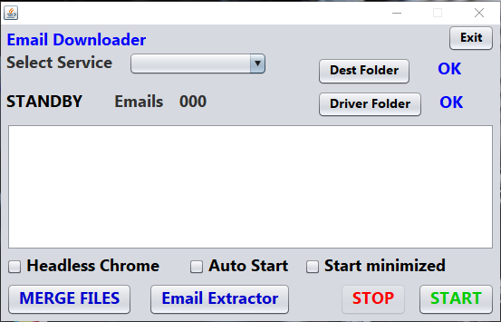
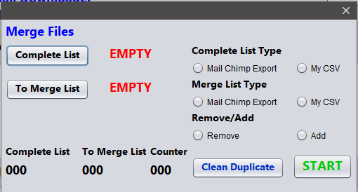
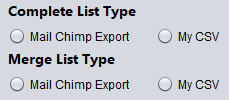
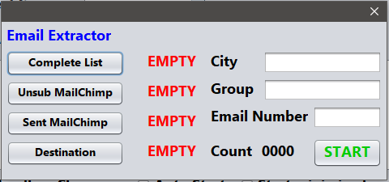

# Email Downloader
Email Downloader is software to get email from web. It works with Chromium Driver. 
Some features were created to manage Mail Chimp service.

## FYI

This project was created for educational purpose only. Please don't use this software to commit any illegal actions.


# User Guide

This paragrapth explains how user can use Email Downloader by GUI.


**Close App**

To close application user must click on Exit button. X button is used to reduce app in System Tray.

**Dest Folder**

Here User can choose Destination Folder where a CSV file will be created. In that file will be written email downloaded.

**Driver Folder**

User must specify where Chromium exe file is stored.

**Headless Chrome**

This feature allows Chromium to start in background, this means that no Chrome window will be show.

**Auto Start**

If enabled, Email Downloader will copy a shortcut to startup folder. This allows the software to automatically startup after Windows Login.

**Start minimized**

If enabled the software will start in System Tray.


### Services

User can choose between 4 services:
* Ordine Commercialisti di Roma
* Consiglio Nazionale Notai
* Pagine Gialle
* Albo Avvocati di Roma


## Merge Files

This feature can add or remove email from a file.



**Complete List**

This is the file that will be affected by changes (add/remove)

**To Merge File**

File that will be used to adding or remove emails from Complete List.

**Files Type**



User must select type to distinguish a file that was exported by Mail Chimp Services and a file that was generated by Email Downloader.

**Remove/Add**

This allows user to decide to Add or Remove emails. In both cases, the software will read "To Merge List" file and will add/remove these emails in "Complete List" file.

**Clean Duplicate**

This feature will check and delete duplicates from Complete List file.


## Email Extractor

This feature was created to extract emails to send to manage Mail Chimp free subscription.



"Unsubscribed" and "Sent" are not required.
User can filter email by "City", "Group".
**Email Number** is required.


# Code Guide
In this guide will be explained some method used.

## Autostart

To make Email Downloader start automatically after Windows Login, is necessary to create a link and copy it into startup folder. To do this create shortcut JShellLink project was used.
**System.getProperty("user.name")** get Windows user name, this will be used to build startup folder path.

```java
private void shortcutAutostartAdd(){
        JShellLink link= new JShellLink();
        String jarName= "EmailDownloader.jar";
        String filePath= System.getProperty("user.dir")+"\\" + jarName;
        String windowsUser= System.getProperty("user.name");
        String startupFolder= "C:\\Users\\" + windowsUser + "\\AppData\\Roaming\\Microsoft\\Windows\\Start Menu\\Programs\\Startup";
        link.setFolder(startupFolder);
        link.setName(jarName);
        link.setPath(filePath);
        link.save();
    }
```
